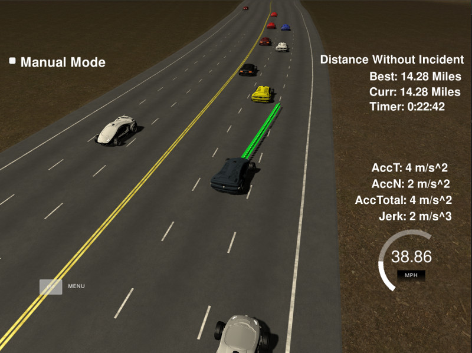

# CarND-Path-Planning-Project
Self-Driving Car Engineer Nanodegree Program

## Design
Waypoints throughout the entire lap are connected using splines. Values `x, y, dx, dy` can thus be found for any value of `s`.
In order to achieve smooth driving path (avoid erroneous linear extrapolation) at the start/finish line the spline is extended by one point in each direction.
```
// helper.cpp extend_waypoints  
map_waypoints.insert(map_waypoints.begin(), map_waypoints[map_waypoints.size()-1]);
map_waypoints.push_back(map_waypoints[1]);
```
[extend_waypoints() in helper.cpp](src/helper.cpp)

In order for `s`-values to be always increasing, the extrapolation values are adjusted with the length of the track.
```
map_waypoints_s[0] -= max_s;
map_waypoints_s[map_waypoints_s.size()-1] += max_s;
```
[main() in main.cpp](src/main.cpp)

### Behavior
Optimal lane is decided based on ego vehicle state and the sensor fusion data of surrounding vehicles. 
```
int car_lane = (int)car_d / lane_width;
vector<double> lane_speeds = helper.GetLaneSpeeds(car_s, car_lane, car_speed, max_speed, sensor_fusion);
LanePlan plan = helper.GetLanePlan(lane_speeds, car_lane, max_speed, car_speed);
int goal_lane = plan.lane;
double goal_speed = plan.speed;
```
[main() in main.cpp](src/main.cpp)

Lane speeds for each lane are calculated based on the sensor fusion data received from the simulator.
The speed of vehicles that are within a defined safety distance from the ego vehicle in each lane will be recorded.
The slowest speed determines the overall lane speed. 
```
// Vehicle is not far ahead of ego vehicle
if (car_s < (ego_s + safety_distance_forward))
{
  // Safety distance behind ego only necessary if vehicle not in same lane
  double rear_buffer = (car_lane == ego_lane) ? 0 : safety_distance_backward;

  // Vehicle close to ego now or in the future
  bool car_close_to_ego_now = car_s > (ego_s - rear_buffer);
  bool car_close_to_ego_future = car_s_future > (ego_s_future - rear_buffer);

  // Limit speed if vehicle is (will be) close to ego
  if (car_close_to_ego_now || car_close_to_ego_future)
  {
    lane_speeds[car_lane] = min(car_speed, lane_speeds[car_lane]);
  }
}
```
[Helper::GetLaneSpeeds() in helper.cpp](src/helper.cpp)


Knowledge of lane speeds will allow for decision of preferred lane.
Since two adjacent lanes can be similar in suitability, the vehicle can make conflicting decisions in two analyses that are very close in time.
For that reason, inertia is introduced in the lane changing algorithm which enforces a minimum time between lane changes.
This minimum time guarantees that an initiated lane change will be completed and thereby eliminates swerving between two lanes.  

```
// New lane change decision cannot be taken within defined time window
int lane_change_inertia {6};

// Determine whether lane change has occured recently
long seconds = std::chrono::system_clock::now().time_since_epoch().count()/1000/1000/1000;
bool allow_lane_change = (seconds - this->lane_change_timestamp) > lane_change_inertia;

// Stay in current lane at current speed if lane change is not allowed
if (!allow_lane_change) return {this->lane, ego_speed, false};
```
[Helper::GetLanePlan() in helper.cpp](src/helper.cpp)

If the ego vehicle current lane speed is limited by traffic, adjacent lanes will be checked for higher available speeds.

```
// If current lane speed is limited
if (lane_speeds[ego_lane] < max_speed)
{
  // Slow down to follow car ahead
  plan.speed = lane_speeds[ego_lane];

  if (ego_lane == center_lane)
  {
    // Change to left or right lane if free
    if (lane_speeds[left_lane] > max_speed)
      plan = LanePlan(left_lane, ego_speed, true);
    else if (lane_speeds[right_lane] > max_speed)
      plan = LanePlan(right_lane, ego_speed, true);
  }
  else
  {
    // Change to center lane if free
    if (lane_speeds[center_lane] > max_speed)
      plan = LanePlan(center_lane, ego_speed, true);
  }
}
```

If lane change occurs, the lane number and time of decision is recorded so that next lane change cannot happen until enough time has elapsed.
```
// Save lane number and time of change to avoid rapid lane change and swerving
if (plan.change)
{
  this->lane_change_timestamp = seconds;
  this->lane = plan.lane;
}
```
[Helper::GetLanePlan() in helper.cpp](src/helper.cpp)


### Trajectory

#### Reference speed
The ego vehicle reference speed is determined by speed limit, other cars, and ego vehicle current speed.
```
// Slow down if approaching vehicle in front
// Speed up if road is free and speed limit is not reached
if (ref_speed > (goal_speed - speed_increment))
{
  ref_speed -= speed_increment;
}
else if (ref_speed < max_speed)
{
  ref_speed += speed_increment;
}
``` 
[main() in main.cpp](src/main.cpp)

#### Reference position
The trajectory is based on a spline that starts from a reference position.
This position is typically the final position given to (and returned from) the simulator.
If no previous path exists (typically when starting from rest), the reference position will be the ego vehicle current position.
One previous position will also be created in order to avoid discontinuities from the spline linear extrapolation.
```
// Choose reference position based on previous path length
int prev_path_size = previous_path_x.size();
if (prev_path_size < 2)
{
  // Reference position is current position
  ref_x = car_x;
  ref_y = car_y;
  ref_s = car_s;

  // Prior position is artificially created based on current ego heading
  ref_yaw = deg2rad(car_yaw);
  pre_ref_x = ref_x - cos(ref_yaw);
  pre_ref_y = ref_y - sin(ref_yaw);
}
else
{
  // Reference position is last position from previous planning
  ref_x = previous_path_x[prev_path_size-1];
  ref_y = previous_path_y[prev_path_size-1];
  ref_s = end_path_s;

  // Prior position is penultimate position from previous planning
  pre_ref_x = previous_path_x[prev_path_size-2];
  pre_ref_y = previous_path_y[prev_path_size-2];
  ref_yaw = atan2(ref_y-pre_ref_y, ref_x-pre_ref_x);

  // Reuse positions from previous planning
  for (int i = 0; i < prev_path_size; ++i)
  {
    next_x_vals.push_back(previous_path_x[i]);
    next_y_vals.push_back(previous_path_y[i]);
  }
}       
```
The reference position and prior position are saved for use in spline.
```
// Add first two points
ptsx.push_back(pre_ref_x);
ptsx.push_back(ref_x);
ptsy.push_back(pre_ref_y);
ptsy.push_back(ref_y);
```
[main() in main.cpp](src/main.cpp)

#### Predict future positions
The number and spacing of future waypoints ahead of the reference positions are defined in `num_wp` and `wp_spacing`.
```
for (int i = 0; i < num_wp; ++i)
{
  // Frenet s-position of future waypoint and wrap-around start/finish line
  double s = ref_s + (i+1)*wp_spacing;
  s = fmod(s, max_s);

  // Frenet d-position for center of chosen lane and correction offset for simulator "outside lane" message
  double d = ((double)goal_lane+0.5)*(double)lane_width;
  d += (1-goal_lane)*lane_correction;

  // Calculate X-Y cartesian coordinates using s-splines created from waypoints map data
  double wp_x = helper.x(s) + d*helper.dx(s);
  double wp_y = helper.y(s) + d*helper.dy(s);
  ptsx.push_back(wp_x);
  ptsy.push_back(wp_y);
}
```
[main() in main.cpp](src/main.cpp)

#### Convert to vehicle coordinates
The points stored in `ptsx` and `ptsy` are converted into ego vehicle coordinates where the reference position is the origin (0, 0) with zero heading (along the x-axis).
```
// Transform into ego vehicle coordinates
for (int i = 0; i < ptsx.size(); ++i)
{
  // Translation
  double x = ptsx[i] - ref_x;
  double y = ptsy[i] - ref_y;

  // Rotation
  ptsx[i] = cos(0-ref_yaw)*x - sin(0-ref_yaw)*y;
  ptsy[i] = sin(0-ref_yaw)*x + cos(0-ref_yaw)*y;
}
```

#### Define spline trajectory for limited horizon
Since points are in ego vehicle coordinates and the scope is local, x-position is always increasing which is a requirement for the spline library.
```
// Define spline where y is defined by x
tk::spline cartesian;
cartesian.set_points(ptsx, ptsy);
```

Trajectory is now calculated for a defined distance ahead in the x-direction, defined in `horizon_x`.
The y-position and corresponding diagonal distance are calculated accordingly.
```
double horizon_y = cartesian(horizon_x);
double horizon_distance = distance(0, 0, horizon_x, horizon_y);
```

The point `(x_future, y_future)` starts at the origin in ego vehicle coordinates.
The number of steps until reaching the horizon point depends on distance, update timestep, and reference speed.
The projected step length in local ego coordinates is assigned to `step_length_x`.
```
double num_steps = horizon_distance/timestep/ref_speed;
double step_length_x = horizon_x/num_steps;
```

#### Calculate new global positions and send to simulator
Global points are to be added to `next_x_vals, next_y_vals` for use in the simulator.
The following point x-value is linearly added together with its corresponding y-value.
The position is converted into global coordinates and added to list of points destined for the simulator.

```
// Add new points (global coordinates)
for (int i = 0; i < horizon_steps - prev_path_size; ++i)
{
  // Determine next position in ego vehicle coordinates
  x_future += step_length_x;
  y_future = cartesian(x_future);

  // Convert next position to global coordinates
  double x_global, y_global;
  
  // Rotation
  x_global = cos(ref_yaw)*x_future - sin(ref_yaw)*y_future;
  y_global = sin(ref_yaw)*x_future + cos(ref_yaw)*y_future;
  
  // Translation
  x_global += ref_x;
  y_global += ref_y;

  // Add position to be sent to simulator
  next_x_vals.push_back(x_global);
  next_y_vals.push_back(y_global);
}
```
[main() in main.cpp](src/main.cpp)

### Lane change example


### Waypoints
Waypoints are located in the center of the road with approximately 40 m average spacing. Each waypoint in the list ([data/highway_map.txt](data/highway_map.txt)) contains [x,y,s,dx,dy] values. x and y are the waypoint's map coordinate position, the s value is the distance along the road to get to that waypoint in meters, the dx and dy values define the unit normal vector pointing outward of the highway loop.
                                                                                         
The highway's waypoints loop around so the frenet s value, distance along the road, goes from 0 to 6945.554.

 
### Simulator
The Term3 Simulator can be downloaded from the [releases tab](https://github.com/udacity/self-driving-car-sim/releases).

### Project 
In this project your goal is to safely navigate around a virtual highway with other traffic that is driving +-10 MPH of the 50 MPH speed limit. You will be provided the car's localization and sensor fusion data, there is also a sparse map list of waypoints around the highway. The car should try to go as close as possible to the 50 MPH speed limit, which means passing slower traffic when possible, note that other cars will try to change lanes too. The car should avoid hitting other cars at all cost as well as driving inside of the marked road lanes at all times, unless going from one lane to another. The car should be able to make one complete loop around the 6946m highway. Since the car is trying to go 50 MPH, it should take a little over 5 minutes to complete 1 loop. Also the car should not experience total acceleration over 10 m/s^2 and jerk that is greater than 50 m/s^3.

## Basic Build Instructions

1. Clone this repo.
2. Make a build directory: `mkdir build && cd build`
3. Compile: `cmake .. && make`
4. Run it: `./path_planning`.

Here is the data provided from the Simulator to the C++ Program

#### Main car's localization Data (No Noise)

["x"] The car's x position in map coordinates

["y"] The car's y position in map coordinates

["s"] The car's s position in frenet coordinates

["d"] The car's d position in frenet coordinates

["yaw"] The car's yaw angle in the map

["speed"] The car's speed in MPH

#### Previous path data given to the Planner

//Note: Return the previous list but with processed points removed, can be a nice tool to show how far along
the path has processed since last time. 

["previous_path_x"] The previous list of x points previously given to the simulator

["previous_path_y"] The previous list of y points previously given to the simulator

#### Previous path's end s and d values 

["end_path_s"] The previous list's last point's frenet s value

["end_path_d"] The previous list's last point's frenet d value

#### Sensor Fusion Data, a list of all other car's attributes on the same side of the road. (No Noise)

["sensor_fusion"] A 2d vector of cars and then that car's [car's unique ID, car's x position in map coordinates, car's y position in map coordinates, car's x velocity in m/s, car's y velocity in m/s, car's s position in frenet coordinates, car's d position in frenet coordinates. 

## Details

1. The car uses a perfect controller and will visit every (x,y) point it recieves in the list every .02 seconds. The units for the (x,y) points are in meters and the spacing of the points determines the speed of the car. The vector going from a point to the next point in the list dictates the angle of the car. Acceleration both in the tangential and normal directions is measured along with the jerk, the rate of change of total Acceleration. The (x,y) point paths that the planner recieves should not have a total acceleration that goes over 10 m/s^2, also the jerk should not go over 50 m/s^3. (NOTE: As this is BETA, these requirements might change. Also currently jerk is over a .02 second interval, it would probably be better to average total acceleration over 1 second and measure jerk from that.

2. There will be some latency between the simulator running and the path planner returning a path, with optimized code usually its not very long maybe just 1-3 time steps. During this delay the simulator will continue using points that it was last given, because of this its a good idea to store the last points you have used so you can have a smooth transition. previous_path_x, and previous_path_y can be helpful for this transition since they show the last points given to the simulator controller with the processed points already removed. You would either return a path that extends this previous path or make sure to create a new path that has a smooth transition with this last path.

## Tips

A really helpful resource for doing this project and creating smooth trajectories was using http://kluge.in-chemnitz.de/opensource/spline/, the spline function is in a single hearder file is really easy to use.

---

## Dependencies

* cmake >= 3.5
 * All OSes: [click here for installation instructions](https://cmake.org/install/)
* make >= 4.1
  * Linux: make is installed by default on most Linux distros
  * Mac: [install Xcode command line tools to get make](https://developer.apple.com/xcode/features/)
  * Windows: [Click here for installation instructions](http://gnuwin32.sourceforge.net/packages/make.htm)
* gcc/g++ >= 5.4
  * Linux: gcc / g++ is installed by default on most Linux distros
  * Mac: same deal as make - [install Xcode command line tools]((https://developer.apple.com/xcode/features/)
  * Windows: recommend using [MinGW](http://www.mingw.org/)
* [uWebSockets](https://github.com/uWebSockets/uWebSockets)
  * Run either `install-mac.sh` or `install-ubuntu.sh`.
  * If you install from source, checkout to commit `e94b6e1`, i.e.
    ```
    git clone https://github.com/uWebSockets/uWebSockets 
    cd uWebSockets
    git checkout e94b6e1
    ```
